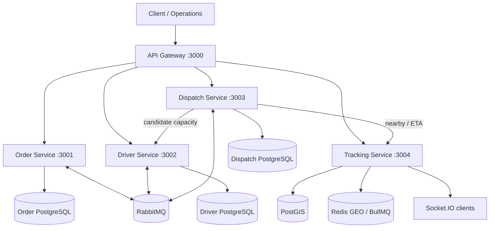
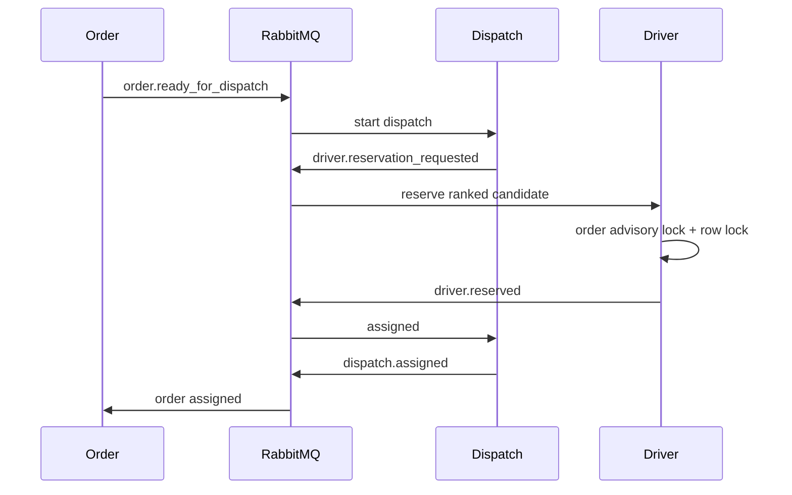

# RouteFast Architecture

## Current architecture — v0.6.6

RouteFast is a distributed last-mile logistics platform composed of five independently deployable NestJS applications. Each bounded context owns its persistence and invariants; integration happens through HTTP or explicit RabbitMQ events.



## Bounded-context ownership

| Context | Owns | Does not own |
|---|---|---|
| Order | order lifecycle, idempotent creation | driver capacity, GPS |
| Driver | driver availability, capacity, reservations | dispatch policy |
| Dispatch | assignment workflow, scoring, decision audit, route heuristic | direct driver mutation |
| Tracking | current location, GPS history, nearby search, ETA approximation | driver capacity |
| Gateway | external HTTP facade and correlation propagation | business state |

No cross-service database reads are allowed.

## Communication

### Synchronous HTTP

Used when the caller requires an immediate authoritative answer: API facade calls, Dispatch candidate queries and Tracking proximity/ETA queries. Dispatch wraps critical synchronous dependencies in circuit breakers.

### RabbitMQ

Used for workflow progression and integration events. Delivery semantics are **at least once**.

Reliability controls:

- Transactional Outbox;
- Consumer Inbox;
- event IDs + correlation IDs;
- idempotent handlers;
- bounded retries;
- dead-letter queues.

## Dispatch consistency model



Across contexts the system is eventually consistent. A failed workflow is repaired with compensating events rather than distributed transactions.

## Concurrency model

Driver Service protects two independent races:

1. several orders competing for one driver's capacity;
2. duplicated concurrent reservation events for one order selecting different drivers.

Controls include `FOR UPDATE` / `SKIP LOCKED`, transaction-scoped advisory locking by `orderId`, capacity validation, unique reservation ownership, API idempotency and Inbox deduplication.

## Tracking model

```text
GPS → Tracking → Redis GEO → immediate live state
              ├→ Socket.IO → clients
              └→ BullMQ → PostGIS → durable history
```

An out-of-order GPS event may be stored in history but cannot overwrite a newer current position in Redis.

## Decisioning

Dispatch combines nearby location data with authoritative Driver capacity data. `geo-score-v1` ranks candidates by distance, remaining capacity, current load and GPS freshness. Driver Service still performs the final transactional reservation validation.

The multi-order `paired-insertion-v1` planner is a bounded heuristic with pickup-before-dropoff and capacity invariants. It is not presented as an optimal VRP solver.

## Failure containment

- RabbitMQ retry + DLQ for asynchronous failures.
- BullMQ delayed assignment timeout.
- Saga compensation for release/cancellation.
- Circuit breaker for synchronous Driver/Tracking dependencies.
- Liveness/readiness separation for orchestration platforms.

## Observability

All applications expose structured JSON logs and Prometheus metrics and initialize OpenTelemetry tracing.

```text
NestJS → OTLP → OpenTelemetry Collector → Jaeger
NestJS / RabbitMQ → Prometheus → Grafana
Logs → stdout/container pipeline
```

Operational correlation uses both `correlationId` and OpenTelemetry `traceId`.

## Deployment model

- one monorepo;
- five independent application images;
- stateless application workloads on Kubernetes;
- HPA in the portable base;
- optional KEDA overlay for RabbitMQ backlog-driven scaling;
- PostgreSQL/PostGIS, RabbitMQ and Redis treated as external stateful dependencies in the cloud target.

AWS blueprint: EKS + ALB, RDS/PostGIS, Amazon MQ RabbitMQ, ElastiCache Redis and ADOT to CloudWatch/X-Ray.

## Engineering boundary

The architecture is intentionally considered feature-complete for the portfolio objective. Further changes require evidence from reliability, stress testing or product requirements. See [progressive stress methodology](./docs/performance/STRESS_TEST.md) and the [ADR index](./docs/adr/README.md).
