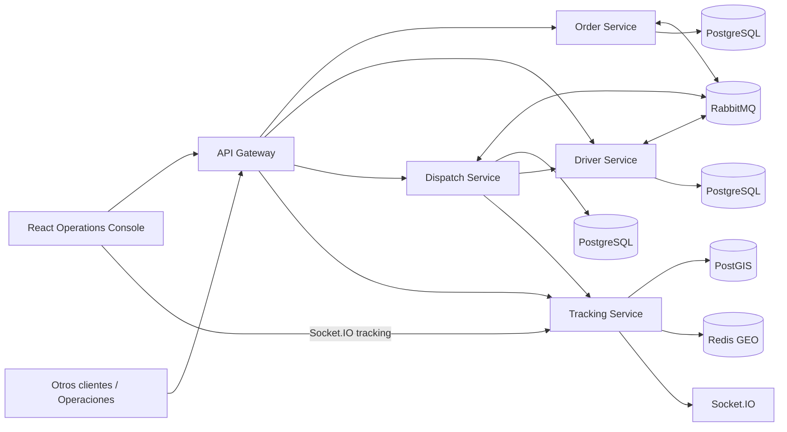

# RouteFast

**Plataforma distribuida de logística de última milla y orquestación de entregas**

> Decisiones rápidas. Entregas confiables.

RouteFast es un caso de estudio de ingeniería **backend-first** centrado en los problemas difíciles de logística de última milla: **correctitud de workflows distribuidos, asignación concurrente de conductores, mensajería confiable, tracking geoespacial en tiempo real, contención de fallos y operabilidad medible**.

No es un CRUD de entregas. La pregunta central es:

> ¿Cómo mantener correctos pedidos, conductores, asignaciones y eventos GPS cuando existen mensajes duplicados, fallos parciales y concurrencia real?

## Evidencia medida

| Área | Evidencia |
|---|---|
| Calidad | 10 suites Jest / **27 tests**; TypeScript estricto; build de 5 aplicaciones NestJS |
| Seguridad | `npm audit --omit=dev` → **0 vulnerabilidades de producción reportadas** |
| Smoke | p95 **45.27 ms**, p99 **73.88 ms**, 0% errores |
| Idempotencia | p95 **118.36 ms**, consistencia de duplicados **100%** |
| Carga mixta | **~38 iter/s**, 0% errores, 0 iteraciones descartadas |
| Orders p95 | **66.29 ms** |
| Tracking p95 | **17.65 ms** |
| Stress progresivo | sostuvo la etapa de ~200 ops/s; la saturación aparece al escalar hacia ~300–400 ops/s; **0% errores HTTP** en la repetición post-sampling |
| Validación en navegador | Operations Console en React consume contratos HTTP + Socket.IO, ofrece ES/EN, mapa OpenStreetMap y ejecuta un flujo E2E distribuido guiado |

Son benchmarks **locales documentados**, no una afirmación de capacidad máxima de producción. Ver [baseline de performance](./docs/performance/BASELINE_v0.6.5.md) y [baseline de seguridad](./docs/security/SECURITY_BASELINE_v0.6.4.md).

## Arquitectura



Regla de ownership: Order controla el estado del pedido; Driver controla capacidad y reservas; Dispatch controla la política de asignación; Tracking controla ubicación. Ningún servicio lee las tablas internas de otro.

## Decisiones principales

- Transactional Outbox + Consumer Inbox para mensajería at-least-once confiable.
- Idempotency Keys + locks PostgreSQL para duplicados y carreras concurrentes.
- Saga y operaciones compensatorias en lugar de transacciones distribuidas.
- Retry limitado + DLQ en RabbitMQ.
- Redis GEO para ubicación caliente y PostGIS para historial espacial durable.
- Protección ante GPS fuera de orden.
- Circuit Breaker en dependencias síncronas de Dispatch.
- OpenTelemetry, Prometheus/Grafana y Jaeger para diagnóstico.
- HPA + overlay KEDA para autoscaling.
- Heurística paired-insertion explícitamente acotada para multiorden.

Ver el [índice de ADR](./docs/adr/README.md).

## Ejecución local

```powershell
Copy-Item .env.example .env
npm install
npm run typecheck
npm test
npm run build

docker compose --profile observability up -d
npm run start:all:no-build
```

En otra terminal, inicia la consola operativa:

```powershell
npm run ops:dev
```

Abre `http://localhost:5173`. La consola permite validar Orders, Drivers, Dispatch, tracking REST/WebSocket, ETA, historial, compensación y optimización de rutas desde un cliente real. Incluye selector ES/EN y un mapa operacional real con Leaflet/OpenStreetMap. Ver [Operations Console](./docs/frontend/OPS_CONSOLE.md).

Para pruebas de carga, usa otra terminal:

```powershell
npm run load:preflight
npm run load:smoke
npm run load:idempotency
npm run load:mixed
```

Para buscar el punto de saturación de forma progresiva:

```powershell
npm run load:stress
```

El perfil escala aproximadamente `50/s → 100/s → 200/s → 400/s`. La metodología completa está en [STRESS_TEST.md](./docs/performance/STRESS_TEST.md).

## Regla de optimización

No se cambia código por intuición. Si stress/k6 muestra una señal de saturación, se localiza el componente con Grafana/Jaeger, se hace **una sola optimización dirigida** y se repite exactamente el mismo benchmark.

## Documentación clave

- [Arquitectura](./ARCHITECTURE.md)
- [Caso de estudio](./docs/portfolio/CASE_STUDY.md)
- [Guía para entrevista](./docs/portfolio/INTERVIEW_GUIDE.md)
- [Operations Console](./docs/frontend/OPS_CONSOLE.md)
- [Performance baseline](./docs/performance/BASELINE_v0.6.5.md)
- [Stress before/after](./docs/performance/STRESS_AFTER_v0.6.9.md)
- [Security baseline](./docs/security/SECURITY_BASELINE_v0.6.4.md)
- [ADR index](./docs/adr/README.md)
- [Checklist de evidencias](./docs/evidence/SCREENSHOT_CHECKLIST.md)

RouteFast está en modo **showcase y evidencia**: la arquitectura backend se considera completa para el objetivo de portafolio y la Operations Console existe para demostrar y validar los contratos públicos sin introducir nueva autoridad de dominio.


## Evidencia de stress progresivo

El primer punto de saturación está documentado en [`docs/performance/STRESS_BASELINE_v0.6.6.md`](docs/performance/STRESS_BASELINE_v0.6.6.md). La repetición controlada está en [`docs/performance/STRESS_AFTER_v0.6.9.md`](docs/performance/STRESS_AFTER_v0.6.9.md): el run post-sampling terminó con 0% de errores HTTP, 33,828 iteraciones completas y desplazó el agotamiento explícito de VUs desde la etapa de ~200 ops/s hacia el ramp de ~300–400 ops/s.


## Consola Operativa — experiencia guiada

RouteFast v0.7.6 elimina el selector Simple/Técnico. La consola utiliza una única experiencia **operacional + técnica**: todas las capacidades públicas permanecen visibles y cada pantalla explica su propósito, operaciones principales y fuente backend. Actividad API, laboratorio de optimización, controles REST/Socket.IO, correlación y evidencia de scoring están disponibles siempre, sin cambiar de modo.

Consulta [`PHASE_7_3_GUIDED_OPERATIONS_UX.md`](PHASE_7_3_GUIDED_OPERATIONS_UX.md).


## Consola Operativa — tema adaptable, filtros y ruta del conductor

RouteFast v0.7.4 incorpora temas **Sistema / Claro / Oscuro**, reduce el impacto del fondo blanco con superficies más suaves y corrige el layout de Asignaciones para que el detalle de scoring no desborde la pantalla. Entregas, Flota y Asignaciones incluyen filtros sobre la ventana operacional acotada.

El Mapa en vivo puede construir la ruta de un conductor seleccionado usando el contrato backend `route-plan`. El orden de paradas sigue siendo responsabilidad del backend; el navegador usa OSRM únicamente para dibujar geometría vial y cae a segmentos directos si el servicio de routing no está disponible. El mapa usa tiles estándar de OpenStreetMap sin API key de aplicación; el modo Oscuro aplica un tratamiento visual sobre esa misma capa.

Ver [`PHASE_7_4_ADAPTIVE_THEME_FILTERS_ROUTE.md`](PHASE_7_4_ADAPTIVE_THEME_FILTERS_ROUTE.md).


## Consola Operativa — claridad de rutas

RouteFast v0.7.5 consolida **Mapa en vivo** como superficie operacional de rutas. Al seleccionar un conductor en esa pantalla se solicita automáticamente al backend la ruta de sus entregas activas asignadas; el mapa muestra la secuencia ordenada de paradas, el ETA y la distancia vial. OSRM sigue siendo únicamente una capa de presentación para geometría/duración y cae al ETA de RouteFast y segmentos directos cuando no está disponible.

El antiguo Planificador se conserva como **Laboratorio de optimización**. Su objetivo es validar el algoritmo y comparar secuencia base vs optimizada, no operar rutas del día a día; Rastreo en vivo sigue siendo la superficie operacional de rutas. El menú lateral queda fijo a toda la altura de la ventana, las tablas usan cabeceras adaptadas al tema y el mapa deja de depender de tiles CARTO que solicitan API key.

Ver [`PHASE_7_5_ROUTE_CLARITY.md`](PHASE_7_5_ROUTE_CLARITY.md).


## Consola Operativa — responsabilidades unificadas

RouteFast v0.7.6 elimina los modos de experiencia y estandariza todas las pantallas alrededor de tres preguntas explícitas: **para qué sirve esta pantalla, qué puedo hacer aquí y qué capacidad backend es dueña de los datos**. La navegación es siempre Resumen, Órdenes, Conductores, Rastreo en vivo, Despacho, Laboratorio de optimización y Actividad API. Las explicaciones operativas se mantienen, pero la evidencia técnica ya no se oculta detrás de un selector.
