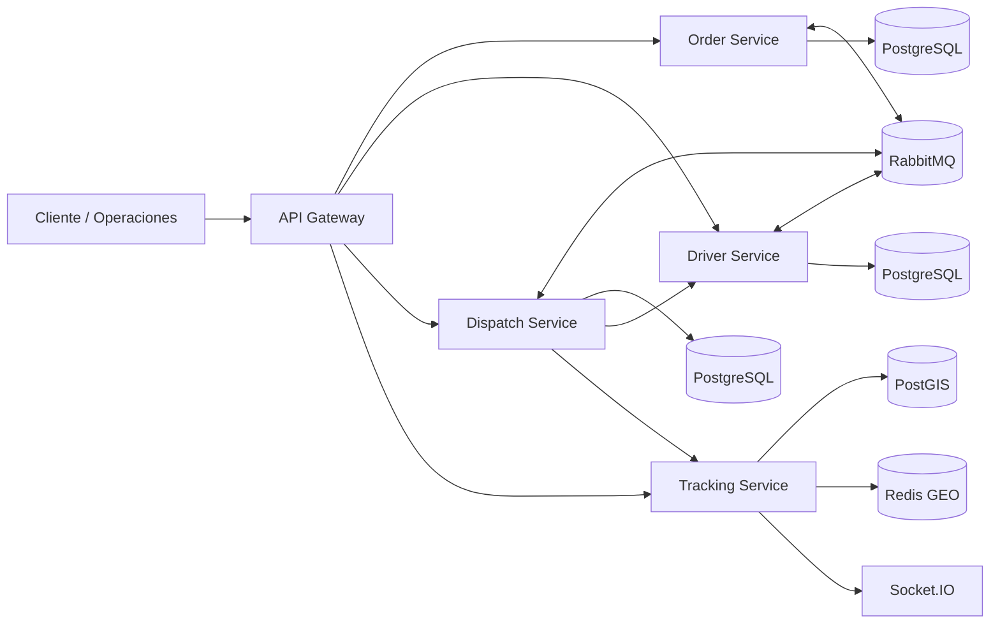

# RouteFast

**Plataforma distribuida de logística de última milla y orquestación de entregas**

> Decisiones rápidas. Entregas confiables.

RouteFast es un caso de estudio de ingeniería backend centrado en los problemas difíciles de logística de última milla: **correctitud de workflows distribuidos, asignación concurrente de conductores, mensajería confiable, tracking geoespacial en tiempo real, contención de fallos y operabilidad medible**.

No es un CRUD de entregas. La pregunta central es:

> ¿Cómo mantener correctos pedidos, conductores, asignaciones y eventos GPS cuando existen mensajes duplicados, fallos parciales y concurrencia real?

## Evidencia medida

| Área | Evidencia |
|---|---|
| Calidad | 10 suites Jest / **27 tests**; TypeScript estricto; build de 5 aplicaciones NestJS |
| Seguridad | `npm audit --omit=dev` → **0 vulnerabilidades de producción reportadas** |
| Smoke | p95 **45.27 ms**, p99 **73.88 ms**, 0% errores |
| Idempotencia | p95 **118.36 ms**, consistencia de duplicados **100%** |
| Carga mixta | **~38 iter/s**, 0% errores, 0 iteraciones descartadas |
| Orders p95 | **66.29 ms** |
| Tracking p95 | **17.65 ms** |

Son benchmarks **locales documentados**, no una afirmación de capacidad máxima de producción. Ver [baseline de performance](./docs/performance/BASELINE_v0.6.5.md) y [baseline de seguridad](./docs/security/SECURITY_BASELINE_v0.6.4.md).

## Arquitectura



Regla de ownership: Order controla el estado del pedido; Driver controla capacidad y reservas; Dispatch controla la política de asignación; Tracking controla ubicación. Ningún servicio lee las tablas internas de otro.

## Decisiones principales

- Transactional Outbox + Consumer Inbox para mensajería at-least-once confiable.
- Idempotency Keys + locks PostgreSQL para duplicados y carreras concurrentes.
- Saga y operaciones compensatorias en lugar de transacciones distribuidas.
- Retry limitado + DLQ en RabbitMQ.
- Redis GEO para ubicación caliente y PostGIS para historial espacial durable.
- Protección ante GPS fuera de orden.
- Circuit Breaker en dependencias síncronas de Dispatch.
- OpenTelemetry, Prometheus/Grafana y Jaeger para diagnóstico.
- HPA + overlay KEDA para autoscaling.
- Heurística paired-insertion explícitamente acotada para multiorden.

Ver el [índice de ADR](./docs/adr/README.md).

## Ejecución local

```powershell
Copy-Item .env.example .env
npm install
npm run typecheck
npm test
npm run build

docker compose --profile observability up -d
npm run start:all:no-build
```

En otra terminal:

```powershell
npm run load:preflight
npm run load:smoke
npm run load:idempotency
npm run load:mixed
```

Para buscar el punto de saturación de forma progresiva:

```powershell
npm run load:stress
```

El perfil escala aproximadamente `50/s → 100/s → 200/s → 400/s`. La metodología completa está en [STRESS_TEST.md](./docs/performance/STRESS_TEST.md).

## Regla de optimización

No se cambia código por intuición. Si stress/k6 muestra una señal de saturación, se localiza el componente con Grafana/Jaeger, se hace **una sola optimización dirigida** y se repite exactamente el mismo benchmark.

## Documentación clave

- [Arquitectura](./ARCHITECTURE.md)
- [Caso de estudio](./docs/portfolio/CASE_STUDY.md)
- [Guía para entrevista](./docs/portfolio/INTERVIEW_GUIDE.md)
- [Performance baseline](./docs/performance/BASELINE_v0.6.5.md)
- [Security baseline](./docs/security/SECURITY_BASELINE_v0.6.4.md)
- [ADR index](./docs/adr/README.md)
- [Checklist de evidencias](./docs/evidence/SCREENSHOT_CHECKLIST.md)

RouteFast está en modo **hardening basado en evidencia**: no se añaden patrones o microservicios nuevos sin un requisito de producto, confiabilidad o performance medido.


## Progressive stress evidence

The first saturation run is recorded in [`docs/performance/STRESS_BASELINE_v0.6.6.md`](docs/performance/STRESS_BASELINE_v0.6.6.md). The first explicit saturation signal appeared after entering the ~200 operations/s target level. v0.6.9 preserves the single controlled hot-path optimization—successful-request access-log sampling—and hardens the Windows benchmark launcher while keeping the same concurrently-based five-service runtime for a valid before/after comparison.
