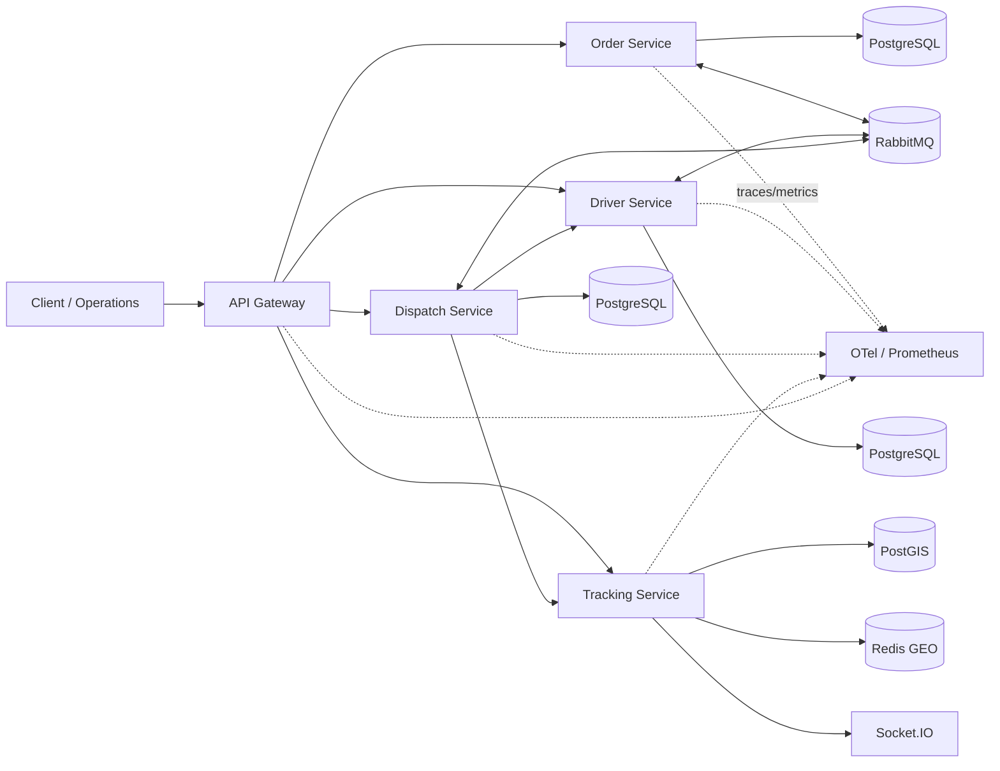

# RouteFast

**Distributed Last-Mile Logistics & Delivery Orchestration Platform**

> Fast decisions. Reliable deliveries.

RouteFast is a backend engineering case study built around the difficult parts of last-mile logistics: **distributed workflow correctness, concurrent driver assignment, reliable messaging, real-time geospatial tracking, failure containment and measurable operability**.

It is intentionally not a delivery CRUD demo. The project asks a harder question:

> How can orders, drivers, assignments and GPS events remain correct when messages are duplicated, services fail mid-workflow and many operations happen concurrently?

## Evidence snapshot

| Area | Evidence |
|---|---|
| Quality | 10 Jest suites / **27 tests passing**; strict TypeScript; all 5 NestJS apps build |
| Security | `npm audit --omit=dev` → **0 production vulnerabilities reported** after controlled hardening |
| Smoke baseline | p95 **45.27 ms**, p99 **73.88 ms**, 0% HTTP errors |
| Idempotency | p95 **118.36 ms**, duplicate consistency **100%**, 0% errors |
| Mixed baseline | **~38 iter/s**, 0% errors, 0 dropped iterations |
| Mixed Orders | p95 **66.29 ms** |
| Mixed Tracking | p95 **17.65 ms** |

These are **local measured baselines**, not production capacity claims. See [performance evidence](./docs/performance/BASELINE_v0.6.5.md) and [security evidence](./docs/security/SECURITY_BASELINE_v0.6.4.md).

## Architecture



**Ownership is non-negotiable:** Order owns order state, Driver owns capacity/reservations, Dispatch owns assignment policy, and Tracking owns location. Services do not read each other's tables.

Detailed diagrams: [system context](./docs/diagrams/system-context.md), [dispatch Saga](./docs/diagrams/dispatch-saga.md), [tracking](./docs/diagrams/tracking-flow.md), [observability](./docs/diagrams/observability.md).

## Engineering decisions that matter

- **Transactional Outbox + Consumer Inbox** for reliable at-least-once messaging without pretending RabbitMQ is exactly-once.
- **Idempotency keys + PostgreSQL locks** to protect duplicate requests and concurrent driver reservation.
- **Saga compensation** instead of distributed database transactions.
- **RabbitMQ retries + DLQ** for bounded asynchronous failure handling.
- **Redis GEO + PostGIS**: low-latency current location and durable spatial history serve different responsibilities.
- **Out-of-order GPS protection**: old events remain historical but cannot rewind the current position.
- **Circuit breakers** around synchronous Dispatch dependencies to contain cascading failures.
- **OpenTelemetry + Prometheus/Grafana + Jaeger** for trace/metric-based diagnosis.
- **Kubernetes HPA + optional KEDA** for portable CPU scaling and backlog-aware consumer scaling.
- **Paired-insertion route planning** as an explicitly bounded heuristic, not a false optimal-VRP claim.

The rationale is recorded in the [ADR index](./docs/adr/README.md).

## Technology

`NestJS` · `TypeScript` · `PostgreSQL` · `PostGIS` · `RabbitMQ` · `Redis` · `BullMQ` · `Socket.IO` · `OpenTelemetry` · `Prometheus` · `Grafana` · `Jaeger` · `Docker` · `Kubernetes` · `KEDA` · `GitHub Actions` · `AWS blueprint` · `k6`

## Run locally

Requirements: Node.js 22+, Docker Desktop.

```powershell
Copy-Item .env.example .env
npm install
npm run typecheck
npm test
npm run build

docker compose --profile observability up -d
npm run start:all:no-build
```

Keep the application terminal running. In a second terminal:

```powershell
npm run load:preflight
npm run load:smoke
npm run load:idempotency
npm run load:mixed
```

Before starting all services you can verify ports `3000..3004` are free:

```powershell
npm run runtime:preflight
```

## Find the saturation point

The baseline workload is intentionally below saturation. The next experiment ramps approximately:

```text
50/s → 100/s → 200/s → 400/s
```

across order creation and GPS ingestion.

```powershell
npm run load:stress
```

The run saves a raw summary under `performance/results/` and generates a Markdown snapshot. See [stress-test methodology](./docs/performance/STRESS_TEST.md).

**Optimization rule:** change no code until traces and metrics identify a measured bottleneck. Then make one targeted optimization and rerun the exact same profile.

## Observability

| Tool | Local URL |
|---|---|
| Grafana | `http://localhost:3005` |
| Prometheus | `http://localhost:9090` |
| Jaeger | `http://localhost:16686` |
| RabbitMQ Management | `http://localhost:15672` |

Logs are structured JSON and carry `correlationId` plus OpenTelemetry `traceId` where a span is active.

## Cloud / delivery

The repository includes:

- multi-stage Docker build for five independently deployable apps;
- Kubernetes base manifests + HPA;
- optional KEDA RabbitMQ queue-depth overlay;
- GitHub Actions typecheck/test/build/security/container scan;
- CodeQL and Trivy;
- GHCR release-image workflow;
- AWS target blueprint using EKS, RDS/PostGIS, Amazon MQ, ElastiCache and ADOT/CloudWatch/X-Ray.

## Documentation map

- [Architecture](./ARCHITECTURE.md)
- [Project scope](./PROJECT_SCOPE.md)
- [ADR index](./docs/adr/README.md)
- [Engineering case study](./docs/portfolio/CASE_STUDY.md)
- [Interview guide](./docs/portfolio/INTERVIEW_GUIDE.md)
- [Performance baseline](./docs/performance/BASELINE_v0.6.5.md)
- [Progressive stress test](./docs/performance/STRESS_TEST.md)
- [Security baseline](./docs/security/SECURITY_BASELINE_v0.6.4.md)
- [Evidence screenshot checklist](./docs/evidence/SCREENSHOT_CHECKLIST.md)
- [Roadmap / scope boundary](./ROADMAP.md)

## Project boundary

RouteFast is now in **evidence-driven hardening mode**. New microservices or patterns are not added by default. Future engineering changes must be justified by a measured reliability, performance or product requirement.


## Progressive stress evidence

The first saturation run is recorded in [`docs/performance/STRESS_BASELINE_v0.6.6.md`](docs/performance/STRESS_BASELINE_v0.6.6.md). The first explicit saturation signal appeared after entering the ~200 operations/s target level. v0.6.9 preserves the single controlled hot-path optimization—successful-request access-log sampling—and hardens the Windows benchmark launcher while keeping the same concurrently-based five-service runtime for a valid before/after comparison.
