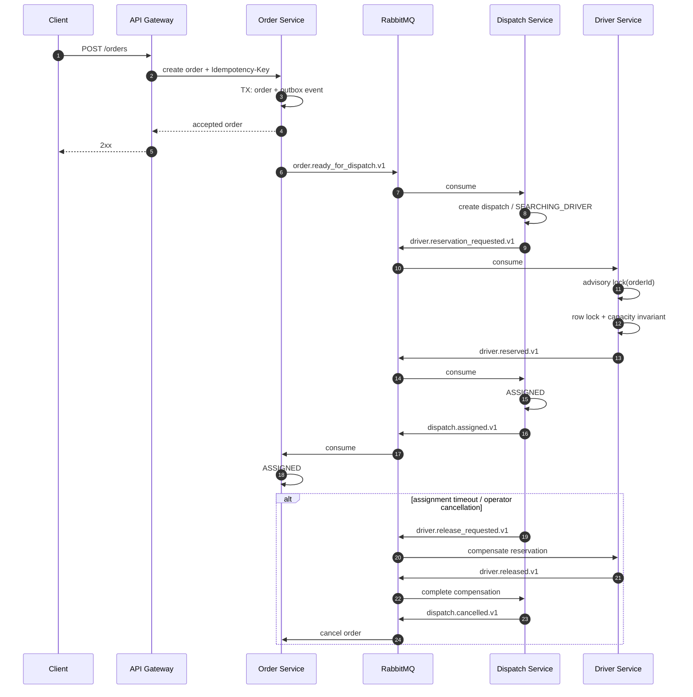

# Dispatch Saga

The workflow is eventually consistent across services. Correctness comes from local ACID transactions, idempotent consumers, Outbox/Inbox and compensating actions—not a distributed database transaction.
