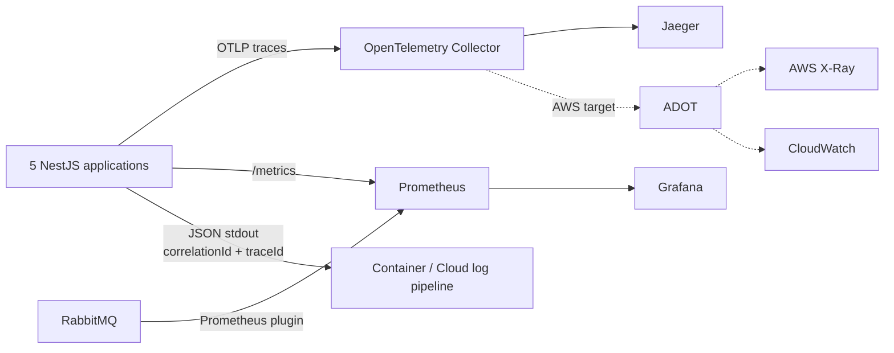

# Observability topology

```mermaid
flowchart LR
  Apps[5 NestJS applications] -->|OTLP traces| Collector[OpenTelemetry Collector]
  Collector --> Jaeger[Jaeger]

  Apps -->|/metrics| Prom[Prometheus]
  RMQ[RabbitMQ] -->|Prometheus plugin| Prom
  Prom --> Grafana[Grafana]

  Apps -->|JSON stdout\ncorrelationId + traceId| Logs[Container / Cloud log pipeline]

  Collector -. AWS target .-> ADOT[ADOT]
  ADOT -.-> XRay[AWS X-Ray]
  ADOT -.-> CW[CloudWatch]
```

Operational diagnosis starts from a business-friendly `correlationId`, links to the trace context, and then correlates traces with latency/error/queue metrics.
