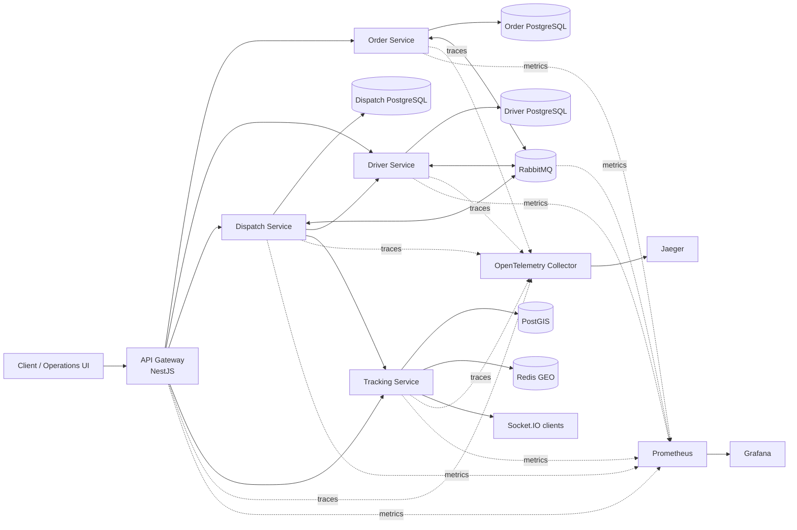

# System context

## Ownership rule

- Order owns order lifecycle state.
- Driver owns availability, capacity and reservation invariants.
- Dispatch owns assignment workflow and decision policy.
- Tracking owns current/historical location.
- No service reads another service's tables directly.
