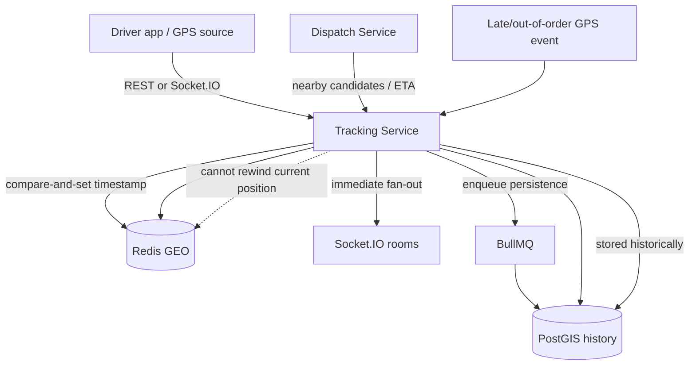

# Real-time tracking flow

Redis serves the hot current-location path. PostGIS remains the durable spatial history. An older event may be retained historically without replacing a newer live position.
